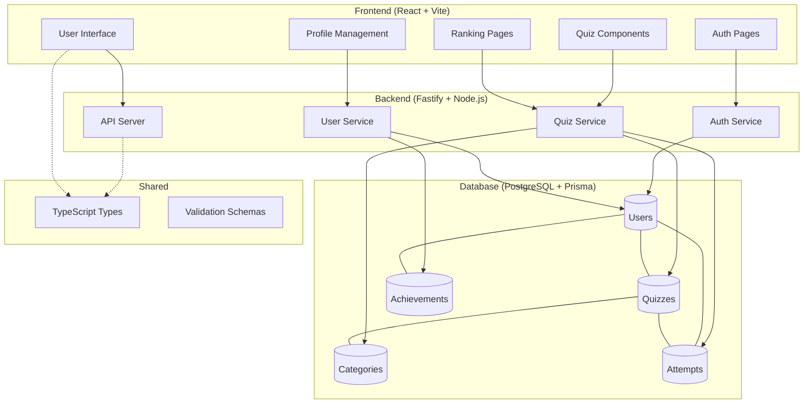
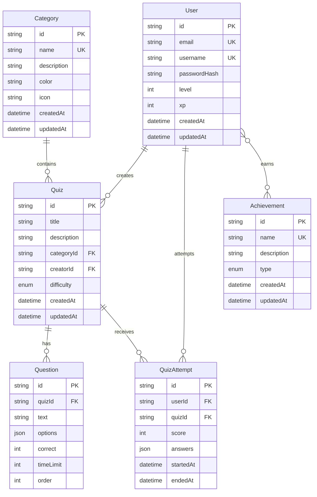

# Quem Sabe, Sabe - Quiz Application

A modern, full-stack quiz application built as a TypeScript monorepo using pnpm workspaces. The application allows users to test their knowledge across multiple categories, create custom quizzes, and track their learning progress with gamification elements.

## Architecture

This is a monorepo containing three main packages: frontend (React), backend (Fastify), and shared types/utilities. The architecture follows a clean separation of concerns with shared TypeScript definitions across packages.



## Database Schema

The application uses PostgreSQL with Prisma ORM for type-safe database operations. The schema supports user management, quiz creation, categorization, and progress tracking.



## Tech Stack

### Monorepo Structure

- **pnpm Workspaces** - Monorepo management with shared dependencies
- **TypeScript** - Full type safety across all packages
- **Shared Package** - Common types, utilities, and validation schemas

### Frontend Package

- **React 18** - UI framework with modern hooks
- **Vite** - Fast build tool and development server
- **React Router** - Client-side routing with protected routes
- **Tailwind CSS** - Utility-first CSS framework
- **Zustand** - Lightweight state management
- **Lucide React** - Modern icon library

### Backend Package

- **Fastify** - High-performance web framework
- **Prisma ORM** - Type-safe database client with migrations
- **PostgreSQL** - Production-ready relational database
- **JWT Authentication** - Secure token-based authentication
- **Zod** - Runtime type validation and schema parsing
- **Swagger/OpenAPI** - Auto-generated API documentation

### Development Tools

- **ESLint** - Code linting with TypeScript support
- **Vitest** - Fast unit testing framework
- **tsx** - TypeScript execution for development

## Project Structure

```
QuemSabeSabe-App/
├── packages/
│   ├── backend/                 # Fastify API server
│   │   ├── src/
│   │   │   ├── features/        # Domain-driven feature modules
│   │   │   │   ├── auth/        # Authentication service
│   │   │   │   ├── quiz/        # Quiz management
│   │   │   │   └── user/        # User management
│   │   │   ├── lib/             # Database utilities
│   │   │   └── types/           # Backend-specific types
│   │   ├── prisma/              # Database schema & migrations
│   │   └── package.json
│   ├── frontend/                # React SPA
│   │   ├── src/
│   │   │   ├── components/      # Reusable UI components
│   │   │   ├── pages/           # Route-level components
│   │   │   ├── stores/          # Zustand state stores
│   │   │   ├── lib/             # API client & utilities
│   │   │   └── types/           # Frontend-specific types
│   │   └── package.json
│   └── shared/                  # Shared TypeScript definitions
│       ├── src/
│       │   └── types/           # Common types & schemas
│       └── package.json
├── pnpm-workspace.yaml          # Workspace configuration
└── package.json                 # Root package with scripts
```

## Development Setup

### Prerequisites

- Node.js 18+
- pnpm 8+
- PostgreSQL

### Installation

1. **Clone and install dependencies**

   ```bash
   git clone <repository-url>
   cd QuemSabeSabe-App
   pnpm install
   ```

2. **Configure environment**

   ```bash
   cp packages/backend/.env.example packages/backend/.env
   # Configure DATABASE_URL, JWT_SECRET, CORS_ORIGIN
   ```

3. **Database setup**

   ```bash
   cd packages/backend
   pnpm prisma migrate dev
   pnpm prisma db seed
   ```

4. **Start development**
   ```bash
   # From root - starts all services concurrently
   pnpm dev
   ```

### Available Endpoints

- Frontend: `http://localhost:5173`
- Backend API: `http://localhost:3000`
- API Documentation: `http://localhost:3000/docs`
- Prisma Studio: `pnpm --filter=backend prisma:studio`

## Scripts

### Development

```bash
pnpm dev                         # Start all packages in watch mode
pnpm dev:shared                  # Watch shared package changes
pnpm --filter=backend dev        # Backend only
pnpm --filter=frontend dev       # Frontend only
```

### Building

```bash
pnpm build                       # Build all packages
pnpm build:shared                # Build shared package
pnpm build:backend               # Build backend only
pnpm build:frontend              # Build frontend only
```

### Database Operations

```bash
pnpm --filter=backend prisma:generate   # Generate Prisma client
pnpm --filter=backend prisma:migrate    # Run database migrations
pnpm --filter=backend prisma:studio     # Open database browser
```

### Production

```bash
pnpm start                       # Start production servers
```

## API Documentation

The backend automatically generates OpenAPI/Swagger documentation available at `/docs`. The API follows RESTful conventions with the following main endpoints:

- `POST /api/v1/auth/login` - User authentication
- `POST /api/v1/auth/register` - User registration
- `GET /api/v1/categories` - List quiz categories
- `GET/POST /api/v1/quizzes` - Quiz operations
- `POST /api/v1/quizzes/:id/attempt` - Submit quiz attempt
- `GET /api/v1/ranking` - Global rankings

## Development Notes

- **Hot Reload**: All packages support hot reloading during development
- **Type Safety**: Shared types ensure consistency between frontend and backend
- **Monorepo Benefits**: Shared dependencies, coordinated builds, and simplified deployment
- **Database Migrations**: Prisma handles schema evolution with migration files
- **Authentication**: JWT tokens with automatic refresh and route protection

## License

MIT License
