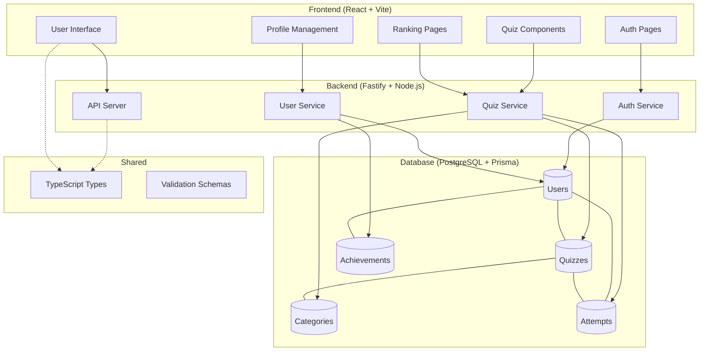

# Quem Sabe, Sabe - Quiz Application

Full-stack quiz application built as a TypeScript monorepo using pnpm workspaces. This project was made for the discipline of user experience at the UFG (Federal University of Goias).

## Architecture

Monorepo containing three main packages: frontend (React), backend (Fastify), and shared types/utilities.



## Tech Stack

### Monorepo Structure

- **pnpm Workspaces** - Monorepo management with shared dependencies
- **TypeScript** - Full type safety across all packages
- **Shared Package** - Common types, utilities, and validation schemas

### Frontend Package

- **React 18** - UI framework with modern hooks
- **Vite** - Fast build tool and development server
- **React Router** - Client-side routing with protected routes
- **Tailwind CSS** - Utility-first CSS framework
- **Zustand** - Lightweight state management
- **Lucide React** - Modern icon library

### Backend Package

- **Fastify** - High-performance web framework
- **Prisma ORM** - Type-safe database client with migrations
- **PostgreSQL** - Production-ready relational database
- **JWT Authentication** - Secure token-based authentication
- **Zod** - Runtime type validation and schema parsing
- **Swagger/OpenAPI** - Auto-generated API documentation

### Development Tools

- **ESLint** - Code linting with TypeScript support
- **Vitest** - Fast unit testing framework
- **tsx** - TypeScript execution for development

## Development Setup

### Prerequisites

- Node.js 18+
- pnpm 8+
- PostgreSQL

### Installation

1. **Clone and install dependencies**

   ```bash
   git clone <repository-url>
   cd QuemSabeSabe-App
   pnpm install
   ```

2. **Configure environment**

   ```bash
   cp packages/backend/.env.example packages/backend/.env
   # Configure DATABASE_URL, JWT_SECRET, CORS_ORIGIN
   ```

3. **Database setup**

   ```bash
   cd packages/backend
   pnpm prisma migrate dev
   pnpm prisma db seed
   ```

4. **Start development**
   ```bash
   # From root - starts all services concurrently
   pnpm dev
   ```

### Available Endpoints

- Frontend: `http://localhost:5173`
- Backend API: `http://localhost:3000`
- API Documentation: `http://localhost:3000/docs`
- Prisma Studio: `pnpm --filter=backend prisma:studio`

## Scripts

### Development

```bash
pnpm dev                         # Start all packages in watch mode
pnpm dev:shared                  # Watch shared package changes
pnpm --filter=backend dev        # Backend only
pnpm --filter=frontend dev       # Frontend only
```

### Building

```bash
pnpm build                       # Build all packages
pnpm build:shared                # Build shared package
pnpm build:backend               # Build backend only
pnpm build:frontend              # Build frontend only
```

### Database Operations

```bash
pnpm --filter=backend prisma:generate   # Generate Prisma client
pnpm --filter=backend prisma:migrate    # Run database migrations
pnpm --filter=backend prisma:studio     # Open database browser
```
